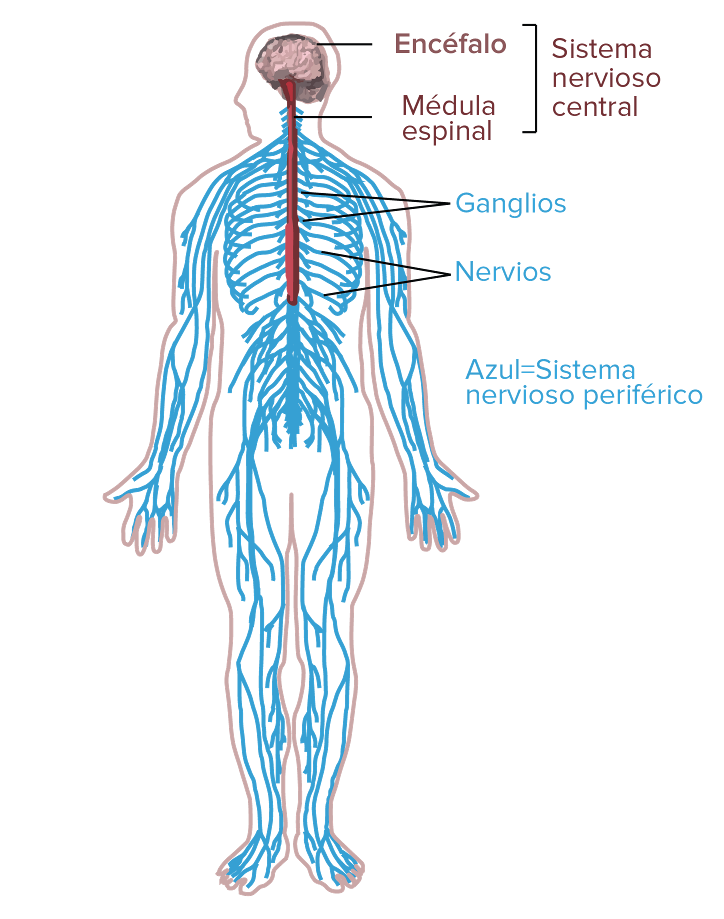
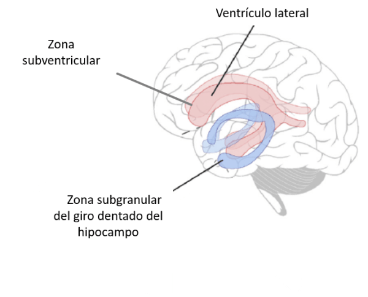
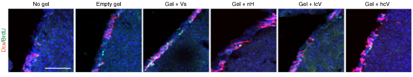

# 1. Introducción

El tejido nervioso es el conjunto de células especializadas que forman el sistema nervioso. Las funciones más importantes del tejido nervioso son recibir, analizar, generar, transmitir y almacenar información proveniente tanto del interior del organismo como fuera de éste. Es un complejo sistema encargado de regulación de diversas funciones orgánicas vitales como son la respiración, la alimentación, la digestión, el sueño, etc. También es el origen de funciones muy complejas y abstractas como el pensamiento, la memoria y el aprendizaje.

Desde el punto de vista anatómico, el sistema nervioso puede dividirse en sistema nervioso central (SNC) —que incluye el encéfalo y la médula espinal— y sistema nervioso periférico (SNP) —el cual comprende los nervios espinales, los nervios craneales y sus ganglios relacionados—.

> Figura 1. Representación del sistema nervioso: En color rojo, SNC. EN color azul: SNP.

## Composición del tejido nervioso

El tejido nervioso está constituido por dos tipos de células:

1. **Neuronas**: su función está basada en el desarrollo de dos propiedades que son la excitabilidad y la conductividad; las neuronas son las encargadas de recibir estímulos del medio, transformarlos e integrarlos, así como transmitirlos como impulsos, integradores cognitivos y motores del sistema nervioso.
2. **Células de la glía o neuroglía**: encargadas de desempeñar diversas funciones: de soporte, defensa, mielinización, nutrición a las neuronas, regulación de la composición del microambiente, protección, formar parte de la barrera hematoencefálica, revestimiento, formación de líquido cefalorraquídeo, reparación de daño cerebral, fagocitosis, etcétera.

### Neurona

La concepción inicial de la estructura del tejido nervioso sostenida por van Geuchten y Camilo Golgi proponía que el tejido nervioso estaba formado por un retículo fibrilar unido a las prolongaciones de las neuronas. Con las impregnaciones argénticas y por las observaciones de Ramón y Cajal se estableció la doctrina neuronal cuyos enunciados postulan lo siguiente: 
1. La neurona es la unidad anatómica del tejido nervioso y sus ramificaciones terminan en otras neuronas sin que exista continuidad
2. Cada neurona es una unidad funcional, el impulso nervioso se transmite de una neurona a otra a través de las sinapsis denominadas por Sherrington
3. Las neuronas son unidades tróficas cuyo cuerpo actúa como centro vital de las prolongaciones

La neurona es el elemento principal en el funcionamiento del tejido nervioso, son células especializadas en recibir señales desde receptores sensoriales, que conducen y transmiten impulsos eléctricos que consisten en cambios en la polaridad eléctrica a nivel de su membrana celular; este grado de especialización conlleva, entre otras cosas, a la nula capacidad de división[[1]](#1).

### Glia
Conjunto de células no neuronales del tejido nervioso que se dispone entre los somas y las prolongaciones neuronales por un lado y los vasos sanguíneos y el tejido conjuntivo por otro. Desarrollan funciones de sostén, nutritivas y secretoras, mantienen la homeostasis, forman mielina e intervienen en la regeneración de las fibras del sistema nervioso. La neuroglía se subdivide en:
- Neuroglía verdadera
- Origen ectodérmico
- Neuroglía falsa o microglía, de origen mesodérmico
La neuroglía verdadera está formada por la neuroglía central (macroglía o astrocitos fibrosos y protoplásmicos, oligodendroglía, células ependimarias, células coroideas, etc.) y por la neuroglía periférica (células de Schwann y células satélites)[[2]](#2).

## Neurogénesis
La neurogénesis es el proceso de formación de neuronas nuevas.
La mayoría de las neuronas en el cerebro se forman en el periodo fetal (de la 9na semana después de concepción hasta el nacimiento). Pero la neurogénesis continúa en zonas específicas del cerebro adulto en las llamadas zonas proliferativas. Estas zonas son la zona subventricular (o SVZ por sus siglas en inglés) y la zona subgranular del giro dentado en el hipocampo (o SGZ por sus siglas en inglés). El hipocampo es una estructura localizada en el lóbulo temporal que tiene un papel fundamental en la memoria, el aprendizaje, la regulación del estado de ánimo y el manejo del espacio[[3]](#3).

> Figura 2. Zonas de neurogénesis

## Lesiones cerebrales
Las lesiones cerebrales de cualquier etiología, incluyendo traumatismos, enfermedades neurodegenerativas o accidentes cerebrovasculares, suponen alteraciones irreversibles en la función cognitiva, el sistema motor y somato sensorial, e incluso de personalidad. En la actualidad no existen tratamientos eficientes, por tanto, la búsqueda de opciones terapéuticas para aumentar la tasa de reemplazo neuronal en el sistema nervioso central es uno de las líneas de investigación más activas en la neurociencia actual. En este sentido, el descubrimiento de la reposición neuronal a partir de células madre neurales (NSC) en el sistema nervioso central (SNC) adulto ha supuesto un nuevo enfoque en el desarrollo de terapias para este tipo de lesiones cerebrales. El descubrimiento de células madre neurales (NSC) en el cerebro adulto, abrió la posibilidad del desarrollo de nuevas terapias neurorregenerativas basadas en la reposición neuronal a partir de NSC (neurogénesis). En condiciones fisiológicas, existe neurogénesis a partir de NSC en dos zonas del cerebro adulto: el hipocampo y la zona subventricular (SVZ), mientras que en el resto del cerebro adulto no existe neurogenesis o es escasa. Sin embargo, cuando hay una lesión cerebral, estas NSC son reclutadas en el perímetro donde se produjo y se puede ver como proliferan células con características de precursores neurales (NPC)[[4]](#4).

# Biomateriales

## Necesidad de biomateriales parecidos al tejido cerebral
La creación de biomateriales parecidos al tejido cerebral es necesaria para muchas tecnologías emergentes.
Las sondas neuronales en las interfaces cerebro-máquina, los modelos microfisiológicos de enfermedades neurológicas, los andamios para la ingeniería de tejidos neuronales, los organoides cerebrales y los proxies cerebrales (por ejemplo, para estudiar las lesiones cerebrales traumáticas reduciendo la necesidad de ensayos con animales) necesitan imitar las propiedades físicas del tejido cerebral para poder aplicarse con éxito. En el caso de las aplicaciones in vivo, una coincidencia mecánica entre los implantes y el tejido cerebral circundante puede minimizar la respuesta inmunitaria y el rechazo del implante debido a la respuesta de cuerpo extraño. La recapitulación del entorno nativo de las neuronas y las células gliales in vitro es crucial para su adecuada diferenciación, motilidad, función y proliferación, ya sea para expandir las células para aplicaciones terapéuticas o para estudiar las respuestas celulares a las señales químicas y los nuevos tratamientos in vitro.

### Propiedades físicas del cerebro 
El cerebro es un tejido complejo, anisótropo y notablemente blando; de hecho, es uno de los órganos más blandos del cuerpo. Y cuando las cosas son blandas, son difíciles de diseñar. Los científicos de materiales han encontrado dificultades para fabricar biomateriales funcionales que se asemejen a la baja rigidez del tejido cerebral. Queda una pregunta importante: ¿por qué el tejido cerebral es tan blando? La arquitectura única del cerebro hace que responda mecánicamente como un material poroviscoelástico, por lo que el líquido cefalorraquídeo puede salir de la matriz del cerebro bajo compresión. Esta respuesta contribuye a la aparente blandura del cerebro, independientemente de la rigidez de los elementos dispuestos en el tejido. En las mediciones microscópicas, el cerebro también es excepcionalmente blando; el parénquima cerebral contiene muy poco colágeno fibroso I, que se correlaciona fuertemente con la rigidez de los distintos órganos. Además, contiene grandes cantidades de diferentes proteoglicanos, proteínas fuertemente glicosiladas que se unen al agua. Esto hace que el contenido de agua en el cerebro sea relativamente alto, entre el 73 y el 85% de la masa total.

Por otro lado, la mielina actúa como material aislante, que está compuesto principalmente por lípidos. De hecho, los lípidos representan aproximadamente el 60% del peso seco total del cerebro.

## 1. MAGBBRIS (Biomaterials for Brain Repair and Imaging after Stroke)

El proyecto europeo (convocatoria EURONANOMED3) MAGBBRIS ("Biomateriales magnéticos para la reparación del cerebro y la obtención de imágenes tras un accidente cerebrovascular" en español) pretende conseguir la reparación de tejidos en caso de ataque isquémico mediante la ingeniería de novedosos nanobiomateriales magnéticos. 

El objetivo del proyecto es demostrar que los factores de crecimiento segregados por las células progenitoras endoteliales, que tienen un potencial demostrado para inducir la reparación de los tejidos, pueden encapsularse en estos nanobiomateriales magnéticos y trasplantarse con éxito y seguridad en cerebros de ratones, con la guía de campos magnéticos, para inducir la reparación de los tejidos.

El proyecto proporcionará una terapia avanzada que podría trasladarse a un estadio clínico por ser no invasiva, segura y estar al alcance de la mayoría de los pacientes con ictus. Los biomateriales se validarán por completo, incluyendo, entre otros aspectos, la citotoxicidad y las propiedades terapéuticas tanto in vitro como in vivo; se utilizarán técnicas avanzadas de imagen (PET, MRI e Imagen Óptica) para monitorizar y guiar la entrega de los biomateriales y para evaluar el efecto terapéutico in vivo a lo largo del tiempo en un modelo de ratón de isquemia cerebral[[5]](#5).

## 2. Electrodos nanoestructurados a base de grafeno para la reparación neuronal
La estimulación eléctrica puede afectar al comportamiento funcional neuronal y favorecer la reparación neuronal. Ambos aspectos requieren electrodos biocompatibles que eviten la formación de radicales, protejan al sistema vivo de los efectos del campo eléctrico y tengan una gran capacidad de carga. Este proyecto ha permitido crear nuevos materiales electroactivos híbridos formados por óxido de iridio y grafeno, con una capacidad 100 veces superior a la del platino habitual en la clínica para las enfermedades de Parkinson/epilepsia/TOC. Estos electrodos permiten la aplicación de campos directos para la reparación neuronal. Además, el grafeno aporta unas propiedades muy interesantes a los electrodos: una mayor estabilidad y una mayor capacidad de carga. 

Resultados recientes demuestran que la reparación neuronal es posible *in vitro*, en tiempos de estimulación muy cortos (40 min), y con electroestimulación de campo directo, controlando la carga suministrada. Resulta significativo que los efectos del campo eléctrico dependan en gran medida del material del electrodo utilizado, y se constata que, de entre muchos materiales probados, la reparación neuronal es óptima para los electrodos híbridos de óxido de iridio y grafeno. El tipo de materiales utilizados marca la diferencia. 

Las implicaciones de estos resultados sugieren que este sistema puede tener un uso inmediato en procedimientos de electroestimulación más seguros, y puede abrir vías para la tan necesaria reparación neuronal[[6]](#6).

## 3. Quitosano
El quitosano ha cobrado cada vez más importancia en diversos enfoques de ingeniería de tejidos para la reconstrucción de nervios periféricos, ya que ha demostrado su potencial para interactuar con las células asociadas a la regeneración y el microambiente neural, lo que conduce a una mejor regeneración axonal y a una menor formación de neuromas.

El componente básico del quitosano es la quitina, un polímero de cadena larga de N-acetilglucosamina que se recoge en los exoesqueletos de los artrópodos. Después de la celulosa, la quitina es el segundo polisacárido más abundante en la naturaleza y se pretende utilizar principalmente en su modificación desacetilada (quitosano) en el campo de la cirugía de los nervios periféricos.

> Figura 3. Estructura química de la quitina y el quitosano. La estructura química de la quitina se basa en un homopolímero lineal de unidades de N-acetil-D-glucosamina (A). Tras la desacetilación parcial, la quitina se convierte en quitosano, utilizado principalmente en la cirugía de los nervios periféricos (B). En los conductos nerviosos de ingeniería tisular, los procesos de biodegradación y sustitución fisiológica comienzan inmediatamente y, por tanto, presentan los mecanismos de acción centrales que influyen en la recuperación del nervio. A diferencia de los materiales de base ácida, como el ácido poliglicólico (PGA) o los derivados de la polilactida, que sufren una disminución del ph durante la biodegradación o signos de reacción inflamatoria de cuerpo extraño, los metabolitos del quitosano demostraron efectos neuroprotectores durante la regeneración de los nervios periféricos.

En una aplicación médica, el quitosano tiene ya una larga historia debido a su biocompatibilidad y a sus propiedades no tóxicas y biodegradables.

### Formaciones del quitosano
En la literatura se han publicado varias formas y técnicas de quitosano que van desde hidrogeles, microesferas o tubos en el campo de la cirugía de los nervios periféricos.

#### Hidrogeles
Los hidrogeles son una forma frecuentemente aplicada en el campo de la ingeniería de tejidos debido a la similitud con la matriz extracelular, y a la modesta forma de procesamiento.
Los hidrogeles como relleno interior en combinación con tubos de quitosano ensayados en condiciones in vivo condujeron a una mayor regeneración del nervio periférico.

#### Láminas
En el campo de la cirugía de nervios periféricos, las láminas de quitosano se aplican directamente para mejorar la regeneración de los nervios periféricos, pero también como arquitectura interna de las guías nerviosas para salvar los defectos de los nervios periféricos. Se ha demostrado la estabilidad mecánica y la biocompatibilidad para las células neurales y la ingeniería de tejidos de los nervios periféricos.

Se ha combinado un tubo de nervio de quitosano con una capa interior de soporte de una película de quitosano sobre defectos de 15 mm de distancia de la lesión del nervio ciático de una rata y presentó una regeneración axonal superior así como una recuperación funcional en comparación con los tubos huecos de quitosano no modificados.

#### Microesferas
El quitosano también puede fabricarse en forma de microesferas o micropartículas, utilizadas principalmente para la administración de fármacos. Se han incorporado microesferas de quitosano cargadas con Factor de Crecimiento Nervioso (NGF) a andamios de colágeno-chitosán para el nervio ciático de una rata y se han obtenido resultados prometedores en cuanto a resultados funcionales en combinación con microcanales como revestimiento interior (Zeng et al., 2014), así como en combinación con un conducto guía de quitosano para la reconstrucción de lesiones del nervio facial[[7]](#7). 

## 5. Células madre encapsuladas en hidrogeles de fibroína de seda
La terapia con células madre constituye un enfoque prometedor para estimular la recuperación funcional tras un ictus. Se han utilizado diferentes tipos de células madre como fuente potencial tanto de células de reemplazo como de factores neurotróficos, aunque los mecanismos de acción precisos y la vía de administración óptima no están claros. En comparación con la administración sistémica, la implantación cerebral requiere menos células y proporciona un injerto de precisión. Sin embargo, la vía cerebral también ha alcanzado niveles relativamente modestos de recuperación funcional tras el ictus, lo que se ha asociado a la grave pérdida de células injertadas que, por lo general, no se observan en el cerebro durante más de 1 a 3 semanas tras el trasplante, como se ha informado en varios modelos preclínicos. En pacientes, se ha informado de que la implantación cerebral de células madre es segura y se han observado mejoras clínicas, pero el pequeño tamaño de la muestra y la heterogeneidad entre los sujetos impiden actualmente el uso de este enfoque específico en la práctica clínica
El uso de biomateriales en la ingeniería de tejidos está en auge y ha proporcionado ejemplos de cómo la integración de células y factores neurotróficos en polímeros basados en biomateriales da lugar a una mejor recuperación funcional tras el accidente cerebrovascular en comparación con la implantación de células o factores terapéuticos por sí solos.

Se observó una recuperación progresiva y significativa exclusivamente en los ratones implantados con células madre mesenquimales (mSCs) encapsuladas en hidrogeles de Fibroína de seda (SF). Dos fenómenos secuenciales podrían explicar tentativamente el efecto positivo de esta terapia en este grupo de animales. En primer lugar, el menor daño cortical detectado tras el tratamiento se atribuye probablemente a las conocidas propiedades neuroprotectoras de las mSC, propiedades que se potenciaron visiblemente cuando esta población celular se implantó junto al biomaterial. En segundo lugar, y probablemente más relevante para la recuperación, la menor cantidad de daño cortical en los animales con mSCs-SF podría constituir un prerrequisito para promover la plasticidad cortical retardada en el tejido que rodea la lesión, lo que llevaría a mejoras conductuales. Las pruebas actuales favorecen la existencia de una reorganización de las áreas peri-infarto en los infartos que abarcan pequeñas regiones del territorio cortical [[8]](#8)

> Figura 4. Imágenes de microscopia de fluorescencia mostrando células madre (en verde) injertadas en el tejido cerebral (azul). Los cuatro cuadros de la izquierda muestran la supervivencia de células madre implantadas sin encapsular, y los cuatro de la derecha la de células encapsuladas en hidrogeles de fibroína de la seda.

## 6. Matriz de ácido hialurónico
Una matriz de ácido hialurónico se modificó a fin de contener y liberar moléculas capaces de promover la formación de vasos sanguíneos. Ello favoreció el restablecimiento del flujo de sangre en la zona infartada. Además, la nueva estructura de conductos vasculares mostró gran parecido, en cuanto a funcionalidad y ramificación, con las existentes en áreas no dañadas.

Durante el desarrollo, la creación de venas, arterias y capilares, proceso también conocido como angiogénesis, resulta esencial para la formación y maduración del sistema nervioso central. Según los resultados, el gel indujo el crecimiento de axones neuronales que recubrieron por completo la lesión, dieciséis semanas después de su inyección. Las nuevas conexiones se estructuraron alrededor de los vasos sanguíneos, recién acaecidos a raíz de la aplicación del material. Este hecho confirmaría la implicación de la red vascular en la regeneración del tejido cerebral.

La matriz de ácido hialurónico y factores de crecimiento actuaría como un «andamio», una estructura capaz de rellenar el vacío de la cicatriz y promover la regeneración del tejido. Asimismo, el gel resultó biodegradable, pues con el tiempo el organismo lo absorbió y desapareció[[9]](#9)

> Neurogénesis y brotación axonal tras el ictus.  Imágenes fluorescentes de neuroblastos (Dcx) y del marcador de proliferación BrdU y de neurofilamentos axonales (NF200) en el lugar del accidente cerebrovascular y sus alrededores.

# Referencias
<a id="1">[1]</a> 
Laura Colín Barenque, Paul Carrillo Mora. Tejido nervioso. En: Dra. Teresa I. Fortoul van der Goes. Histología y Biología celular. 3ra edición. McGRAW-HILL; 2017. Disponible en: [https://accessmedicina.mhmedical.com/content.aspx?bookid=1995&sectionid=150300743](https://accessmedicina.mhmedical.com/content.aspx?bookid=1995&sectionid=150300743)  
<a id="2">[2]</a> 
Neuroglía [Internet]. Fleni [Consultado en Junio 28, 2021]. Disponible en: [https://www.fleni.org.ar/patologias-tratamientos/neuroglia/](https://www.fleni.org.ar/patologias-tratamientos/neuroglia/)  
<a id="3">[3]</a> 
Citlali Helenes González. ¿Qué es la neurogénesis? [Internet]. NueroMx: Septiembre 17, 2020 [Consultado Junio 28, 2021]. Disponible en: [https://www.neuromexico.org/2020/09/17/que-es-la-neurogenesis/](https://www.neuromexico.org/2020/09/17/que-es-la-neurogenesis/)  
<a id="4">[4]</a> 
Elkin Navarro-Quiroz, Roberto Navarro-Quiroz, Pierine España-Puccini, Mostapha Ahmad, Anderson Díaz-Pérez, José Luis Villarreal, Lucy Vásquez, Agusto Torres. Neurogénesis en cerebro adulto. Rev Sal Uni [Internet]. 2017 [Consultado Junio 28, 2021]; Vol. 34(1): pp. 144-159. Disponible en: [https://doi.org/10.14482/sun.34.1.9992](https://doi.org/10.14482/sun.34.1.9992)  
<a id="5">[5]</a> 
MAGBBRIS: Magnetic biomaterials for brain repair and imaging after stroke [Internet]. icmab; Marzo 15, 2018 [Revisado Junio 28, 2021]. Disponible en: [https://icmab.es/brain-related-projects-at-icmab-to-join-the-brain-awareness-week-2018-magnetic-biomaterials-for-brain-repair-and-imaging-after-stroke-2](https://icmab.es/brain-related-projects-at-icmab-to-join-the-brain-awareness-week-2018-magnetic-biomaterials-for-brain-repair-and-imaging-after-stroke-2)  
<a id="6">[6]</a> 
Nano-structured graphene-based electrodes for neural repair [Internet]. icmab; Marzo 13, 2018 [Consultado en Junio 28, 2021]. Disponible en: [https://icmab.es/brain-related-projects-at-icmab-to-join-the-brain-awareness-week-2018-nano-structured-graphene-based-electrodes-for-neural-repair](https://icmab.es/brain-related-projects-at-icmab-to-join-the-brain-awareness-week-2018-nano-structured-graphene-based-electrodes-for-neural-repair)  
<a id="7">[7]</a> 
A. Boecker, S. C. Daeschler, U. Kneser and L. Harhaus. Relevance and Recent Developments of Chitosan in Peripheral Nerve Surgery. Front. Cell. Neurosci. [Internet]. 2019 [Consultado en Junio 29, 2021]. Disponible en: [https://doi.org/10.3389/fncel.2019.00104](https://doi.org/10.3389/fncel.2019.00104)  
<a id="8">[8]</a> 
Laura Fernández-García, José Pérez-Rigueiro, Ricardo Martinez-Murillo, Fivos Panetsos, Milagros Ramos, Gustavo V. Guinea, Daniel González-Nieto. Cortical Reshaping and Functional Recovery Induced by Silk Fibroin Hydrogels-Encapsulated Stem Cells Implanted in Stroke Animals. Front. Cell. Neurosci. [Internet]. 2018 [Consultado en Junio 29, 2021]. Disponible en: [https://doi.org/10.3389/fncel.2018.00296](https://doi.org/10.3389/fncel.2018.00296)
<a id="9">[9]</a> 
Lina R. Nih, Shiva Gojgini, S. Thomas Carmichael, Tatiana Segura. Dual-function injectable angiogenic biomaterial for the repair of brain tissue following stroke. Nat. Mat. [Internet]. 2018 [Consultado en Junio 29, 2021]; vol. 17: p. 642–651. Disponible en: [https://www.nature.com/articles/s41563-018-0083-8.epdf](https://www.nature.com/articles/s41563-018-0083-8.epdf?sharing_token=f8cS0HQZUvZTuP8vafWOxNRgN0jAjWel9jnR3ZoTv0PMOBlgL25podfYAk5vYplKqeQ-Vo9jJ8IsgMw77pHkCF_jD3VRnyYNAeS9cxGzNOTbIZjne3QTmkSwqNjOTD9qUAqee8YgkF9Y8FxoG_h2u0a8Br1d0v99C_UU0lX1LiEpKKFCO9UrQX_oV0nKl9Waz0eLnR0Vzl6NLiAWHq1EzCcV4ZMN7uGt8IH9rRyos7g%3D&tracking_referrer=www.investigacionyciencia.es)
